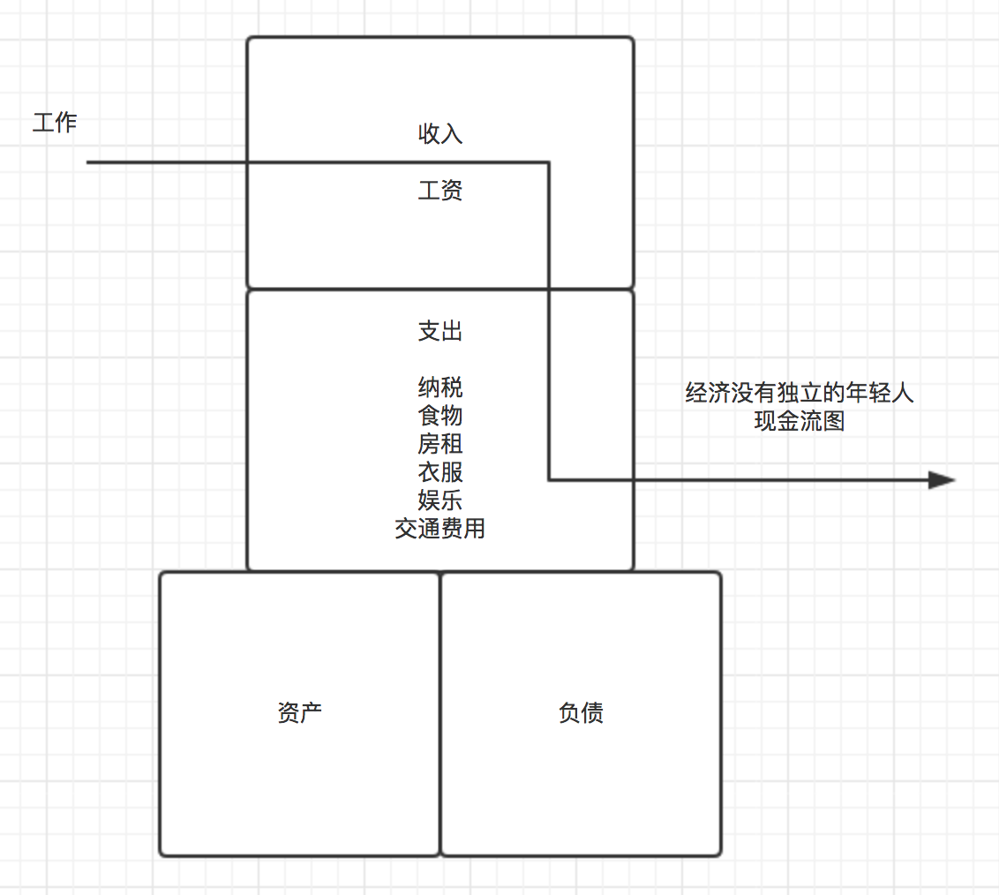
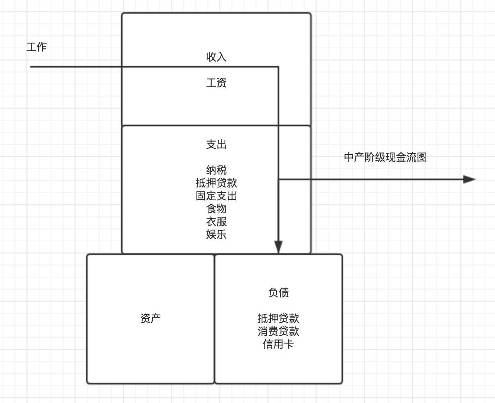
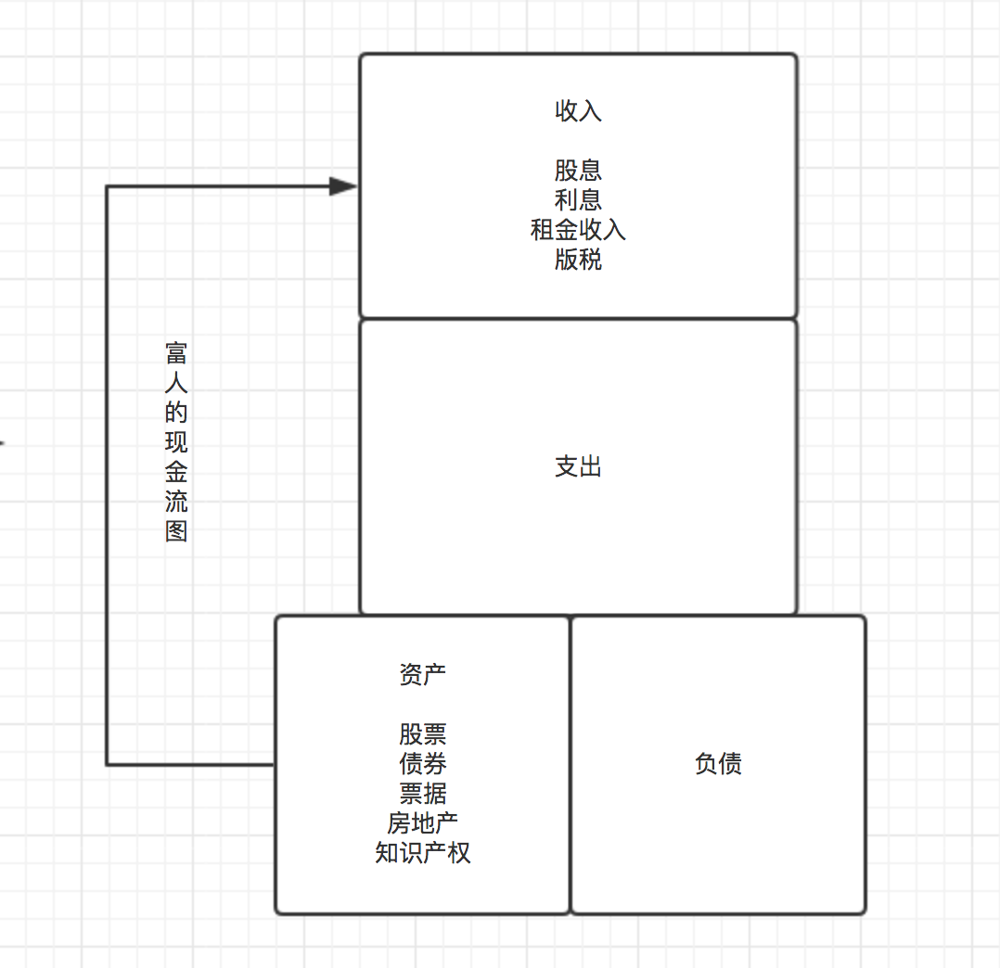

## 为什么要传授财务知识

**Answer**：因为我想要像他们一样财务自由

    1994年，我退休了，那时我47岁，我妻子37岁。退休并不是因为我们没事可干。
    对于我和我妻子来说，只要不发生意想不到的大事，我们就完全可以选择工作或是不工作，我们的财富可以不受通货膨胀的影响，自动增长。
    我想这就是自由。
    资产已经多到可以自我增值，就像种树，你年复一年地浇灌它，终于有一天它不再需要你的照料了。
    它的根已经长得足够深，你现在可以开始享受它带给你的阴凉了。

​    
财务知识的重要性：

    多数人没有意识到，在生活中你挣了多少钱并不重要，重要的是你留下了多少钱。
    我们都听说过穷人买彩票中奖的故事，他们一下子暴富起来，但不久就又变穷了。他们虽然得到了上百万美元但很快又回到他们最初时的样子。
      
    如果人们认为钱能解决一切问题，恐怕他们的日子就不会太好过。
    只有知识才能解决问题并创造财富，那些不是靠财务知识挣来的钱也不会长久。

---

> 大多数人在努力致富时，总是试图在15厘米厚的混凝土上建造帝国大厦。 

规则--资产与负债：

    富人获得资产，而穷人和中产阶级获得负债，只不过他们以为那些负债就是资产。

​     
经典--理解：

    如果你想富有，就必须读懂并理解那些数字。
    
    资产是能把钱放进你口袋里的东西。
    负债是把钱从你口袋里取走的东西。

---

学会看资产/负债现金流图：

> 年轻人现金流

    

> 中产阶级现金流

   

> 富人现金流

   

​    
