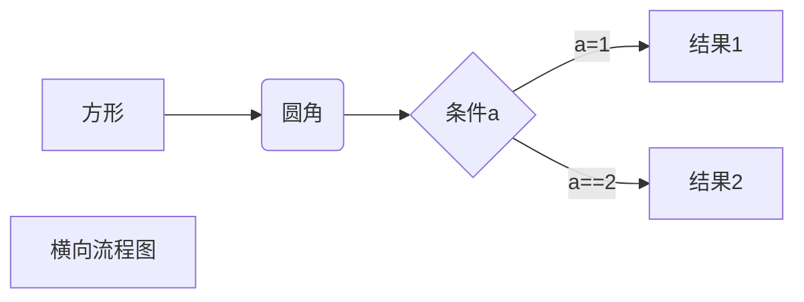
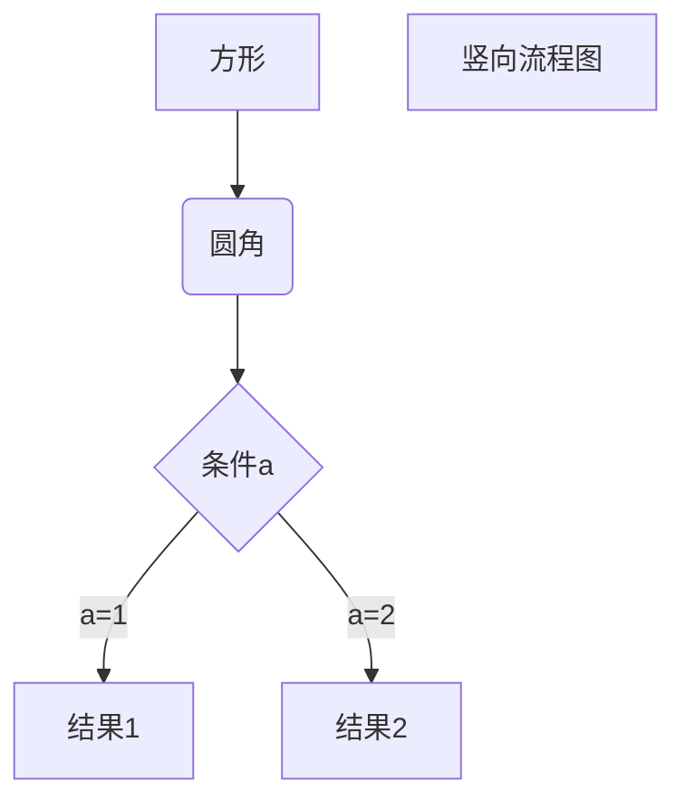
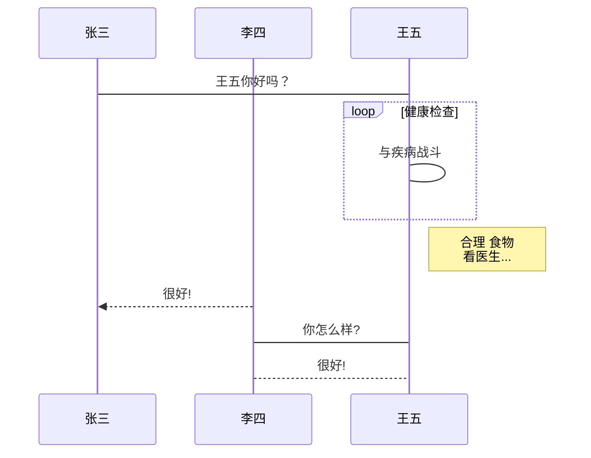
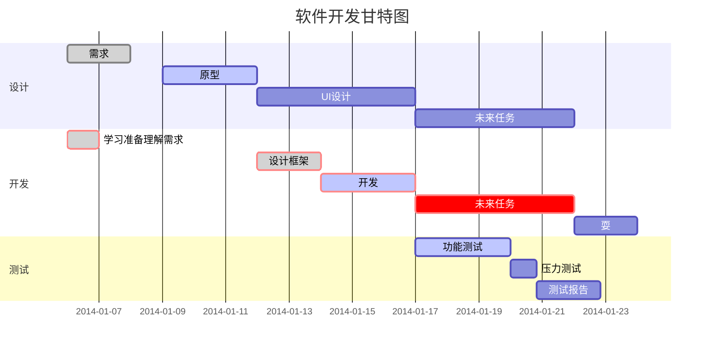

## Markdown 

> Markdown 编写的文档可以导出 HTML、Word、图像、PDF、Epub等多种格式的文档。
>
> 后缀可为.md、.markdown。
>
> 常被用来撰写电子书。

* # 第一种标题展示：

  我展示的是一级标题
  ==================

  我展示的是二级标题
  --------------------------

> 了解了，这种标题展示也是要切换为源码模式，换行粘贴=====和-------，不然是视图模式回车会自动加入一行空行在那里的，那就显示为下面这种情况了。

  我显示不出一级标题效果

  ==================

我显示不出二级标题的效果

--------------------------

  

  * # 第二种标题展示：

    # 一级标题

    ## 二级标题

    ### 三级标题
  
    #### 四级标题
  
    ##### 五级标题
  
    ###### 六级标题

段落没有特殊的格式，直接编写文字就好，段落的换行是使用两个以上的空格加上回车。

那我直接回车呢，默认就是中间有一个空行,默认就是开启一个新的段落了。

那要是我只想换行不想换段落呢。
似乎只能切换为源码模式再来回车才行呢。

# 字体

> *我是斜体*
>
> _我也是斜体_
>
> **我是粗体**
>
> __我也是粗体__
>
> ***我是粗斜体文本***
>
> ___我也是粗斜体文本___

# 分割线

***

****

*****

******

---

----------

# 删除线

~~我有删除线~~

# 下划线

<u>我有下划线</u>

# 脚注

创建脚注 [^我是要搞脚注的文字]

[^我是要搞脚注的文字]:这是我的脚注

# 列表

## 无序列表

* A
* B
* C

+ 1
+ 2
+ 3

- !
- @
- #

## 有序列表

1. 第一项
2. 第二项
3. 第三项

## 列表嵌套

1. 第一项：
   - 第一项第一个元素
   - 第一项第二个元素

2. 第二项：
   + 第二项第二个
   + 第二项第三个

# 区块饮用：在段落啊开头使用> 加一个空格符号:

> ## 我是一个区块，区块也可以嵌套
>
> 最外层
>
> > 第一层嵌套
> >
> > > 第二层嵌套
> > >
> > > > 第三层嵌套

> 第一层
>> 第二层
>>
>>> 第三层，两个>>中间加不加空格都可以，习惯加下

> ## 区块中使用列表：
>
> 1.第一项
> 2.第二项
> * A
> * B
> - 1
> - 2

## 列表中使用区块：

1. 第一项

   > 我是第一项的备注

2. 第二项

   > 我是第二项的备注

# 函数或代码片段 用``包起来

`printf()` 这是一个函数

## 使用四个空格或者tab制表符

* 4个空格开头：

```objective-c
 + (id)getLastObjWithIndex:(NSIndexPath *)indexPath DataSource:(NSArray *)dataSource{
    if ([[dataSource objectAtIndex:indexPath.section] isKindOfClass:[NSArray class]]) {
        NSArray * cellModelArr = [dataSource objectAtIndex:indexPath.section];
        NSInteger index = [cellModelArr count] -1;
        id model = [cellModelArr objectAtIndex:index];
        return model;
    }else {
        NSInteger index = dataSource.count - 1;
        id model = [dataSource objectAtIndex:index];
        return model;
    }
}
```
* 制表符开头：

```objective-c
 + (id)getLastObjWithIndex:(NSIndexPath *)indexPath DataSource:(NSArray *)dataSource{
    if ([[dataSource objectAtIndex:indexPath.section] isKindOfClass:[NSArray class]]) {
        NSArray * cellModelArr = [dataSource objectAtIndex:indexPath.section];
        NSInteger index = [cellModelArr count] -1;
        id model = [cellModelArr objectAtIndex:index];
        return model;
    }else {
        NSInteger index = dataSource.count - 1;
        id model = [dataSource objectAtIndex:index];
        return model;
    }
}
```
* 使用过```开头：

``` objective-c
 + (id)getLastObjWithIndex:(NSIndexPath *)indexPath DataSource:(NSArray *)dataSource{
    if ([[dataSource objectAtIndex:indexPath.section] isKindOfClass:[NSArray class]]) {
        NSArray * cellModelArr = [dataSource objectAtIndex:indexPath.section];
        NSInteger index = [cellModelArr count] -1;
        id model = [cellModelArr objectAtIndex:index];
        return model;
    }else {
        NSInteger index = dataSource.count - 1;
        id model = [dataSource objectAtIndex:index];
        return model;
    }
}
```

# 链接

* 这是一个链接：[菜鸟教程](https://www.runoob.com)

- <https://www.runoob.com>

* 高级：使用变量来代表链接。[菜鸟教程][A]；注意这里使用中括号扩起来的。在文档结尾为变量赋值。***这里设置有没有效，还待验证***

  [A]: https://www.runoob.com

# 图片

> 

* 开头一个感叹号!

* 接着一个方括号，里面放上图片的替代文字；

* 接着一个普通括号，里面放上土坯啊你的地址，或者双引号扩上title属性文字.

  

  

把地址写成一个变量：

![alt 变量测试][B]

[B]: http://static.runoob.com/images/runoob-logo.png

**Markdown 还没有办法指定图片的高度与宽度，可使用html标签:**


# 表格

*Markdown 制作表格使用|来分隔不同的单元格，使用-来分隔表头和其他行*

| 表头1左对齐   | 表头2右对齐   | 表头3居中对齐   |
| :------- | -------: | :-------: |
| 单元格11 | 单元格12 | 单元格13 |
| 单元格21 | 单元格22 | 单元格23 |
| 单元格31 | 单元格32 | 单元格33 |

# 支持HTML元素

使用 <kbd>Ctrl</kbd>+<kbd>Alt</kbd>+<kbd>Del</kbd>重启电脑

## 转义

**文本加粗**

\*\*正常显示星号\*\*

## 公式

*当你需要在编辑器中插入数学公式时，可以使用两个美元符 $$ 包裹 TeX 或 LaTeX 格式的数学公式来实现。提交后，问答和文章页会根据需要加载 Mathjax 对数学公式进行渲染*
$$
\mathbf{V}_1 \times \mathbf{V}_2 =  \begin{vmatrix} 
\mathbf{i} & \mathbf{j} & \mathbf{k} \\
\frac{\partial X}{\partial u} &  \frac{\partial Y}{\partial u} & 0 \\
\frac{\partial X}{\partial v} &  \frac{\partial Y}{\partial v} & 0 \\
\end{vmatrix}
${$tep1}{\style{visibility:hidden}{(x+1)(x+1)}}
$$

# 画流程图

1. 横向流程图



2. 纵向流程图



3.标准流程图

```flow
st=>start: 开始框
op=>operation: 处理框
cond=>condition: 判断框(是或否?)
sub1=>subroutine: 子流程
io=>inputoutput: 输入输出框
e=>end: 结束框
st->op->cond
cond(yes)->io->e
cond(no)->sub1(right)->op
```

4.标准流程图（横向)

```flow
st=>start: 开始框
op=>operation: 处理框
cond=>condition: 判断框(是或否?)
sub1=>subroutine: 子流程
io=>inputoutput: 输入输出框
e=>end: 结束框
st(right)->op(right)->cond
cond(yes)->io(bottom)->e
cond(no)->sub1(right)->op
```

5.UML时序图样例

```sequence
对象A->对象B: 对象B你好吗?（请求）
Note right of 对象B: 对象B的描述
Note left of 对象A: 对象A的描述(提示)
对象B-->对象A: 我很好(响应)
对象A->对象B: 你真的好吗？
```

6.UML时序图复杂样例

```sequence
Title: 标题：复杂使用
对象A->对象B: 对象B你好吗?（请求）
Note right of 对象B: 对象B的描述
Note left of 对象A: 对象A的描述(提示)
对象B-->对象A: 我很好(响应)
对象B->小三: 你好吗
小三-->>对象A: 对象B找我了
对象A->对象B: 你真的好吗？
Note over 小三,对象B: 我们是朋友
participant C
Note right of C: 没人陪我玩
```

7.UM了标准时序图样例



8. 甘特图样例


